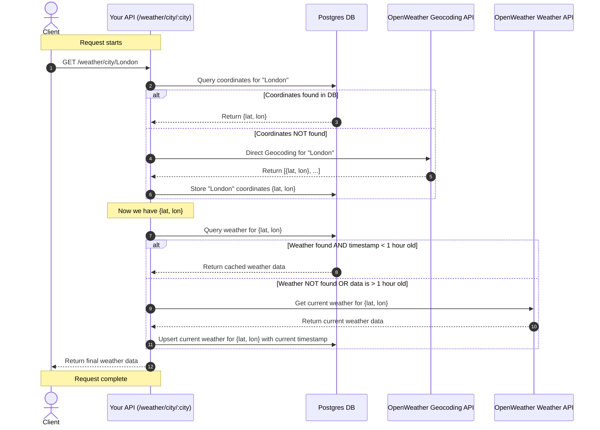

# Introduction
This project uses the openweathermap.org API to retrieve weather data for a requested city.

In order not to exceed the rate limit of our Api Key we can configure the amount of calls per minute allowed in our environment variables.
The city and weather data is then cached in our local database to prevent exhausting our api call limit prematuraly.

# Weather Data Api Call Flow
